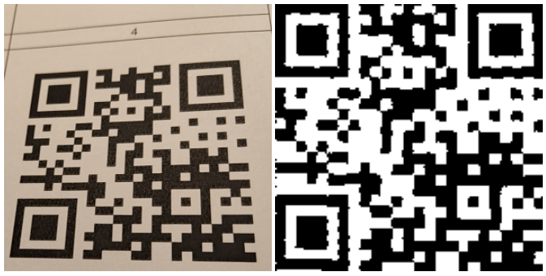

# QRCodejs
# a simple sample image processing algorithm to scann V1 QR codes in javascript

  
note: after aligning it uses prepared liberaries for decoding

# dependencies
[image-js](https://github.com/image-js/image-js)

[perspective transform](https://github.com/jlouthan/perspective-transform)

[jsQR](https://github.com/cozmo/jsQR)
